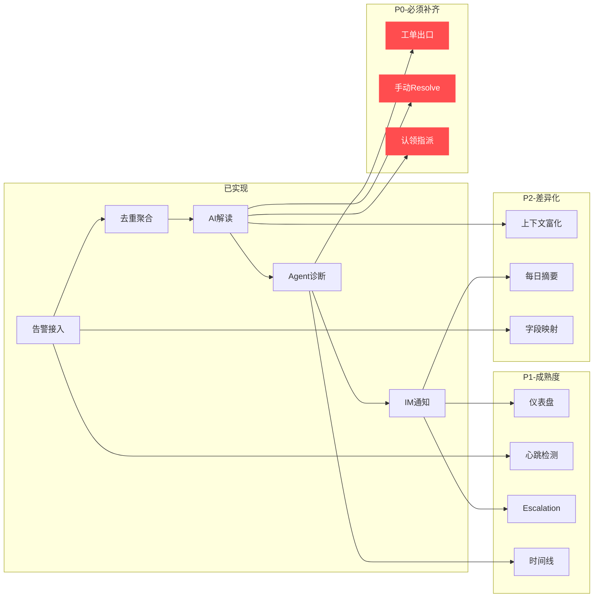

# OpsinTech 智能告警现状分析与闭环补齐方案

## 一、当前实现全景

### 已完成的核心模块

| 模块 | 文件 | 能力 | 状态 |
|------|------|------|------|
| **数据模型** | [alerting.py](file:///Users/kevinliangx/Developer/Repos/PublicCodeHub/KevinLiangX/opsintech/opsintech-platform/backend/app/models/alerting.py) | `raw_alert → signal → incident` 三层模型 + 10 张表 | ✅ 完整 |
| **告警接入** | [providers/](file:///Users/kevinliangx/Developer/Repos/PublicCodeHub/KevinLiangX/opsintech/opsintech-platform/backend/app/alerting/providers) + [ingest.py](file:///Users/kevinliangx/Developer/Repos/PublicCodeHub/KevinLiangX/opsintech/opsintech-platform/backend/app/alerting/ingest.py) | Webhook / Alertmanager / Grafana / CloudWatch / Datadog 五种 Provider | ✅ 完整 |
| **去重 / 聚合** | [dedup.py](file:///Users/kevinliangx/Developer/Repos/PublicCodeHub/KevinLiangX/opsintech/opsintech-platform/backend/app/alerting/dedup.py) + [incident_manager.py](file:///Users/kevinliangx/Developer/Repos/PublicCodeHub/KevinLiangX/opsintech/opsintech-platform/backend/app/alerting/incident_manager.py) | SHA-256 fingerprint 去重 + service×env 聚合 + 时间窗口 | ✅ 完整 |
| **规则引擎** | [rule_engine.py](file:///Users/kevinliangx/Developer/Repos/PublicCodeHub/KevinLiangX/opsintech/opsintech-platform/backend/app/alerting/rule_engine.py) | 抑止 / 聚合 / 去重三类规则 + JSONPath 条件 + 维护窗口 | ✅ 完整 |
| **AI 解读** | [ai_analysis.py](file:///Users/kevinliangx/Developer/Repos/PublicCodeHub/KevinLiangX/opsintech/opsintech-platform/backend/app/alerting/ai_analysis.py) | LLM 自动/手动/条件触发 → ai_summary / ai_impact / ai_suggestion | ✅ 完整 |
| **Agent 诊断** | [ingest.py](file:///Users/kevinliangx/Developer/Repos/PublicCodeHub/KevinLiangX/opsintech/opsintech-platform/backend/app/alerting/ingest.py) L185-296 + [diagnosis_sse.py](file:///Users/kevinliangx/Developer/Repos/PublicCodeHub/KevinLiangX/opsintech/opsintech-platform/backend/app/alerting/diagnosis_sse.py) + [diagnosis_helper.py](file:///Users/kevinliangx/Developer/Repos/PublicCodeHub/KevinLiangX/opsintech/opsintech-platform/backend/app/alerting/diagnosis_helper.py) | SSE 流式诊断 + AG-UI 协议 + cancel/run | ✅ 完整 |
| **IM 通知** | [notify.py](file:///Users/kevinliangx/Developer/Repos/PublicCodeHub/KevinLiangX/opsintech/opsintech-platform/backend/app/alerting/notify.py) + [channels/](file:///Users/kevinliangx/Developer/Repos/PublicCodeHub/KevinLiangX/opsintech/opsintech-platform/backend/app/channels) | 飞书 / Slack / Telegram + 静默时段 + 严重度过滤 + 每日摘要 | ✅ 完整 |
| **数据清理** | [cleanup.py](file:///Users/kevinliangx/Developer/Repos/PublicCodeHub/KevinLiangX/opsintech/opsintech-platform/backend/app/alerting/cleanup.py) | 按租户保留天数自动清理 raw_alert / signal / link | ✅ 完整 |
| **健康监控** | [health_monitor.py](file:///Users/kevinliangx/Developer/Repos/PublicCodeHub/KevinLiangX/opsintech/opsintech-platform/backend/app/alerting/health_monitor.py) | 告警源存活统计日志 | ✅ 基础 |
| **变更事件** | [alerting.py](file:///Users/kevinliangx/Developer/Repos/PublicCodeHub/KevinLiangX/opsintech/opsintech-platform/backend/app/models/alerting.py) L275-300 + [alerts.py](file:///Users/kevinliangx/Developer/Repos/PublicCodeHub/KevinLiangX/opsintech/opsintech-platform/backend/app/gateway/routers/alerts.py) L1731-1800 | ChangeEvent 表 + ingest/list API | ✅ 基础 |
| **API 路由** | [alerts.py](file:///Users/kevinliangx/Developer/Repos/PublicCodeHub/KevinLiangX/opsintech/opsintech-platform/backend/app/gateway/routers/alerts.py) (1800 行) | 25+ 端点覆盖全链路 | ✅ 完整 |
| **前端 UI** | incidents/[page.tsx](file:///Users/kevinliangx/Developer/Repos/PublicCodeHub/KevinLiangX/opsintech/opsintech-platform/frontend/src/app/workspace/incidents/[incident_id]/page.tsx) + tenant-admin 页面 | incident 列表 / 详情 / AI 卡片 / 诊断 SSE / 告警源管理 / 规则管理 / 通知设置 | ✅ 完整 |

### 当前产品价值

产品定位从「告警管理平台」转向了「告警翻译官」——核心价值链：

```
告警风暴 → 去重降噪 → 聚合归一 → AI 解读（让人看懂） → Agent 深度诊断 → IM 推送
```

**已实现的差异化价值：**
1. **三层降噪**：payload_hash 去重 → fingerprint 去重 → service×env 聚合，从源头压缩告警噪音
2. **AI 告警翻译官**：不猜根因，只翻译数据，让值班工程师一眼看懂"发生了什么、影响了谁、先查什么"
3. **Agent 深度诊断**：数字人可以绑定到告警源，自动或手动触发深度排查，SSE 流式呈现
4. **多租户原生**：Day-1 tenant_id 隔离，不像 Alerta 需要后补
5. **IM 原生通知**：飞书/Slack/Telegram 直推，含 AI 摘要，不用额外接 PagerDuty

---

## 二、未闭环的关键缺口（按优先级排列）

### 🔴 P0 — 缺了就无法形成最小闭环

#### 1. Incident → Action 出口（工单/自动化）

**现状**：诊断做完之后，用户只能"看完诊断结果"，没有后续动作出口。

**规划中的定位**：产品规划文档明确写了「创建工单（一个 button + bound tool，分析结果的出口）」，但**目前没有实现**。

**闭环断裂点**：
```
incident → AI解读 → Agent诊断 → ??? → 结束
                                    ↑
                               这里断了
```

**需要补齐**：
- **Ticket Provider 接口**：`create_ticket(incident) → ticket_id, url`
- MVP 先做 **通用 Webhook 出口**（JSON POST 到用户配置的 URL）
- 后续按需补 Jira / 飞书多维表格 / 钉钉等适配器
- incident 详情页加一个 **「创建工单」按钮** + 绑定 tool 的 Agent action

> [!IMPORTANT]
> 这是整个产品闭环最关键的断裂点。没有出口，诊断结果的商业价值无法转化为行动。

#### 2. Incident 手动 Resolve/关闭

**现状**：incident 的 resolve 只通过「resolved signal 自动触发」实现。没有 `POST /api/incidents/{id}/resolve` 端点。

**问题**：很多场景下，值班工程师手动确认恢复后需要手动标记 incident 为 resolved，但当前只能等上游告警源发 resolved signal。如果上游不发（或发迟了），incident 就一直 firing。

**需要补齐**：
- 新增 `POST /api/incidents/{incident_id}/resolve` API
- 前端详情页加「手动恢复」按钮
- 记录 `IncidentAction(actor_id=user_id, action_type="manual_resolved")`

#### 3. Incident 认领/指派

**现状**：`Incident` 表有 `owner_user_id` 和 `owner_team_id` 字段，但**没有 API 来设置它们**。`owner_team_id` 只从 signal labels 自动提取。

**问题**：值班工程师看到 incident 后，无法标记"我来处理"或指派给同事。这在多人协作场景下是基本需求。

**需要补齐**：
- `POST /api/incidents/{id}/assign` — 指定 owner_user_id
- `POST /api/incidents/{id}/claim` — 认领（设置 owner 为当前用户）
- 前端列表/详情页显示 owner 并支持操作

> [!NOTE]
> 产品定位文档写了「不做认领/分派/解决/关闭」，但这是 PagerDuty 的 15 年能力。从 MVP 闭环角度看，**最小化的认领和手动 resolve 是必须的**，否则 incident 列表永远是"一堆 firing 状态没人管的告警"，产品没有行动感。

---

### 🟠 P1 — 影响产品成熟度和用户留存

#### 4. 告警分布/趋势仪表盘

**现状**：`GET /api/incidents/stats` 只返回当前时刻的静态统计（firing/resolved/suppressed 计数 + severity 分布 + top services）。没有时间维度的趋势。

**需要补齐**：
- **MTTR 指标**：平均恢复时间（从 first_seen 到 resolved_at）
- **告警趋势图**：过去 7/30 天的 incident 创建/解决趋势
- **噪音率指标**：suppressed 占 total 的比例
- **服务健康热力图**：哪些服务最频繁出问题
- 前端做一个 **alert dashboard 页面**（不是 incident 列表页）

#### 5. 告警源心跳检测

**现状**：[health_monitor.py](file:///Users/kevinliangx/Developer/Repos/PublicCodeHub/KevinLiangX/opsintech/opsintech-platform/backend/app/alerting/health_monitor.py) 只做日志统计（"3 active sources, 2 with data"），没有主动健康检查和告警。

**需要补齐**：
- 对 pull-based 类型（CloudWatch、Datadog）做定时拉取验证
- 对 push-based 类型做"期望收到数据"的 heartbeat 检测（如果配置了"每5分钟应有数据"但实际没有 → 告警源自身出问题）
- 告警源状态变化时发 IM 通知
- 前端显示告警源健康状态（绿/黄/红）

#### 6. Escalation 规则

**现状**：`AlertRule` 支持 `rule_type: suppression | aggregation | dedup`，但**没有 escalation**。

**需要补齐**：
- 新增 `rule_type: "escalation"` — 当 incident 持续 firing X 分钟未认领 → 自动通知升级
- 支持多级升级链路（5min → 初级值班，15min → 团队 leader，30min → 全群通知）
- 复用现有 IM 通知基础设施

#### 7. Incident Timeline 时间线

**现状**：incident 详情页有 signals 列表，但没有结构化的 **timeline 视图**。

**需要补齐**：
- 在详情页呈现一个时间线：
  ```
  10:00  Signal #1 firing  (source: alertmanager)
  10:02  AI 解读生成
  10:05  Agent 诊断启动
  10:08  Signal #2 firing  (severity 升级)
  10:15  用户认领
  10:20  Signal #3 resolved
  10:20  Incident 自动恢复
  ```
- 前端已有 [signal-timeline.tsx](file:///Users/kevinliangx/Developer/Repos/PublicCodeHub/KevinLiangX/opsintech/opsintech-platform/frontend/src/components/workspace/incidents/signal-timeline.tsx)，需要增强为包含 AI/Action/Change 事件的完整时间线

---

### 🟡 P2 — 提升差异化竞争力

#### 8. 上下文自动收集（ContextEnrichmentProvider）

**现状**：incident 详情页会展示 `recent_changes` 和 `related_incidents`，但这些是简单的 DB 查询，不是 AI 驱动的上下文拼装。

**需要补齐**：
- 实现 Analysis Pipeline Step 2: **ContextEnrichmentProvider**
- 自动关联：同一服务最近 7 天的 incident + 同时段的变更事件 + 相关日志片段
- AI 驱动的相似 incident 匹配（不只是同 service，而是语义相似）
- 把上下文注入 Agent 诊断 prompt

#### 9. 每日摘要定时推送

**现状**：[notify.py](file:///Users/kevinliangx/Developer/Repos/PublicCodeHub/KevinLiangX/opsintech/opsintech-platform/backend/app/alerting/notify.py) 有 `send_daily_digest()` 函数，但**没有调度机制**来定时触发它。

**需要补齐**：
- 在 gateway app.py 中注册一个定时任务（APScheduler / crontab）
- 每天 9:00（租户时区）自动触发 digest 推送
- 摘要内容增强：MTTR、噪音率、top services、新 incident vs resolved

#### 10. 告警源字段映射（Webhook field_mapping）

**现状**：Webhook Provider 的 normalize 逻辑是硬编码的，用户无法自定义哪些 JSONPath 字段映射到 signal 的 title/severity/service。

**需要补齐**：
- 在 `AlertSource.config_json` 中支持 `field_mapping`（JSONPath 表达式）
- Webhook Provider 在 normalize 时读取 field_mapping 动态映射
- 前端告警源配置页增加字段映射 UI

#### 11. 批量告警接收 / Alertmanager 多告警

**现状**：Alertmanager Provider 处理单条告警。但 Alertmanager webhook 实际会一次推多条告警（alerts 数组）。

**需要补齐**：
- Alertmanager Provider 支持 `body.alerts` 数组遍历
- 每条 alert 独立走 ingest pipeline
- 批量处理性能优化

---

### 🔵 P3 — 长期差异化

#### 12. 根因分析（RootCauseSuggestionProvider）

**规划中但 MVP 不做**的 Analysis Pipeline Step 3。AI 不只翻译告警，而是基于上下文推断可能根因。

#### 13. 值班排班（On-Call Schedule）

明确「不做」的能力，但如果有客户需求可作为插件扩展。

#### 14. 移动端推送

当前 IM 通知依赖飞书/Slack 等已有移动端 App。如果需要独立移动推送，需要接入 Push 服务。

#### 15. 告警源测试/模拟

告警源配置后，用户需要验证"配置对了、能接收到数据"。需要 `POST /api/alert-sources/{id}/test` 端点发送模拟告警。

---

## 三、闭环路径建议



### 推荐实施顺序

| 阶段 | 功能 | 预估工期 | 价值 |
|------|------|----------|------|
| **Phase 1 (2周)** | 手动 Resolve + 认领指派 | 3-4天 | 让 incident 有"被人处理"的行动感 |
| | 工单出口（通用 Webhook） | 3-4天 | 闭环出口，诊断结果→行动 |
| | 前端完善（按钮+状态流转） | 3-4天 | 用户可感知的闭环 |
| **Phase 2 (2周)** | Incident Timeline | 3天 | 详情页体验升级 |
| | 仪表盘 + MTTR | 4-5天 | 运维管理者需要的数据 |
| | Escalation 规则 | 3天 | 多级通知链路 |
| **Phase 3 (1周)** | 每日摘要定时推送 | 2天 | 管理者每日感知 |
| | 告警源心跳 + 测试 | 2天 | 运维可信度 |
| | Webhook field_mapping | 2天 | 接入灵活性 |
| **Phase 4 (持续)** | ContextEnrichmentProvider | 1-2周 | AI 上下文自动拼装 |
| | 根因分析 Provider | 2-3周 | 长期差异化 |

---

## 四、核心判断

> [!IMPORTANT]
> 当前最大的产品风险不是功能不够多，而是**诊断做完没有出口**。
> 
> 用户看完 AI 解读和 Agent 诊断后，只能"知道发生了什么"，但**没法做什么**。这不是功能缺失，是**商业闭环的断裂**。
> 
> P0 优先级应该是：**工单出口 > 手动 Resolve > 认领指派**。

产品定位文档说「不做认领/分派/解决/关闭——这些 PagerDuty 做了 15 年」。但这个判断的前提是「DeerFlow 的闭环是 incident → 工作台 → 工作流 → 终端 → 审计」。

**现实是：这条闭环的后半段（工作台→工作流→终端）还没有打通到告警场景。** 所以在中间出口（工单/自动化）没做之前，前半段的价值无法释放。

最小闭环应该是：

```
告警 → 降噪 → AI解读 → Agent诊断 → 工单/自动化 → 状态关闭 → 通知
```

而不是：

```
告警 → 降噪 → AI解读 → Agent诊断 → （结束，没人管后续）
```
